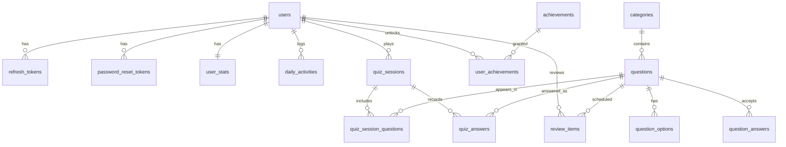

# Mavva — Modelo de Dados (PostgreSQL 16)

Convenções: tabelas no plural, `snake_case`, PKs `id UUID` (exceto tabelas de catálogo,
que usam `int`), timestamps `TIMESTAMPTZ` em UTC, FKs com `ON DELETE CASCADE` quando o
filho não faz sentido sem o pai.

## Diagrama (visão geral)

## Tabelas

### users
| Coluna | Tipo | Notas |
|---|---|---|
| id | UUID PK | |
| email | VARCHAR(255) UNIQUE | login; normalizado para minúsculas na aplicação |
| name | VARCHAR(120) | |
| hashed_password | VARCHAR | bcrypt |
| role | ENUM(user, admin) | admin para o futuro painel |
| timezone | VARCHAR(64) | default `America/Sao_Paulo`; base do streak |
| daily_goal_xp | INT | default 50 |
| created_at / updated_at | TIMESTAMPTZ | |

### refresh_tokens
| Coluna | Tipo | Notas |
|---|---|---|
| id | UUID PK | |
| user_id | UUID FK→users | CASCADE |
| token_hash | VARCHAR(64) UNIQUE | SHA-256 do token opaco — token puro nunca é persistido |
| expires_at | TIMESTAMPTZ | +30 dias |
| revoked_at | TIMESTAMPTZ NULL | preenchido na rotação/logout |
| created_at | TIMESTAMPTZ | |

### password_reset_tokens
`id, user_id FK, token_hash UNIQUE, expires_at (+30 min), used_at NULL, created_at`

### categories *(catálogo, seed)*
| Coluna | Tipo | Notas |
|---|---|---|
| id | INT PK | |
| slug | VARCHAR UNIQUE | ex: `personagens` |
| name | VARCHAR | ex: "Personagens" |
| description | TEXT | |
| icon | VARCHAR | emoji/nome de ícone |
| display_order | INT | ordem na UI |

### questions
| Coluna | Tipo | Notas |
|---|---|---|
| id | UUID PK | |
| external_id | VARCHAR UNIQUE | slug do seed (`personagens-0001`) — upsert idempotente |
| type | ENUM(multiple_choice, open_answer) | |
| text | TEXT | enunciado |
| explanation | TEXT | sempre presente; cita ARC quando útil |
| divergence_note | TEXT NULL | preenchida quando há divergência entre interpretações cristãs ou base em tradição |
| testament | ENUM(old, new) | derivado do livro, mas materializado p/ filtro |
| book | VARCHAR(40) | slug canônico (`genesis`, `mateus`…) — validado contra catálogo dos 66 livros |
| chapter | INT | |
| verse_start / verse_end | INT / INT NULL | intervalo de versículos |
| theme | VARCHAR(80) | ex: "Fé", "Aliança" |
| difficulty | ENUM(easy, medium, hard, expert) | |
| category_id | INT FK→categories | |
| subcategory | VARCHAR(80) NULL | livre (ex: "Reis de Judá") |
| tags | VARCHAR[] | GIN index |
| is_active | BOOL | soft-disable sem apagar histórico |
| created_at / updated_at | TIMESTAMPTZ | |

Índices: `(category_id, difficulty)`, `(testament)`, GIN em `tags`.

### question_options *(múltipla escolha — exatamente 4 por pergunta, 1 correta)*
`id UUID PK, question_id FK CASCADE, text TEXT, is_correct BOOL, position INT`
Constraint de aplicação (validada no seed): 4 opções, exatamente 1 `is_correct`.

### question_answers *(resposta aberta — variações aceitas)*
`id UUID PK, question_id FK CASCADE, text VARCHAR, position INT`
`position = 0` é a resposta canônica exibida no feedback.

### quiz_sessions
| Coluna | Tipo | Notas |
|---|---|---|
| id | UUID PK | |
| user_id | UUID FK | |
| mode | ENUM(practice, review) | review consome a fila SRS |
| filters | JSONB | `{testament, category_ids, difficulty, theme}` — snapshot do que foi pedido |
| question_count | INT | |
| correct_count | INT | atualizado a cada resposta |
| xp_earned | INT | consolidado no complete |
| started_at | TIMESTAMPTZ | |
| completed_at | TIMESTAMPTZ NULL | sessão abandonada fica NULL |
| duration_seconds | INT NULL | |

### quiz_session_questions *(perguntas sorteadas na criação — ordem fixa, anti-refetch)*
`session_id FK, question_id FK, position INT` — PK composta `(session_id, question_id)`.

### quiz_answers
| Coluna | Tipo | Notas |
|---|---|---|
| id | UUID PK | |
| session_id | UUID FK CASCADE | |
| question_id | UUID FK | |
| selected_option_id | UUID NULL | múltipla escolha |
| answer_text | TEXT NULL | resposta aberta (como digitada) |
| is_correct | BOOL | |
| time_spent_seconds | INT NULL | |
| answered_at | TIMESTAMPTZ | |

UNIQUE `(session_id, question_id)` — impede responder duas vezes.

### user_stats *(denormalização 1:1 — dashboard em uma query)*
| Coluna | Tipo |
|---|---|
| user_id | UUID PK FK |
| total_xp / level | INT / INT |
| current_streak / longest_streak | INT / INT |
| last_activity_date | DATE NULL *(no fuso do usuário)* |
| questions_answered / correct_answers | INT / INT |
| perfect_sessions | INT |
| total_time_seconds | INT |
| updated_at | TIMESTAMPTZ |

> Atualizada transacionalmente pelo serviço de gamificação ao completar sessões.
> Fonte da verdade recuperável: pode ser recalculada de `quiz_answers`/`daily_activities`.

### daily_activities *(série temporal do gráfico de evolução + cálculo de streak)*
`id UUID PK, user_id FK, date DATE, xp INT, questions INT, correct INT, time_seconds INT`
UNIQUE `(user_id, date)`. `date` já convertida para o fuso do usuário.

### review_items *(repetição espaçada — SM-2)*
| Coluna | Tipo | Notas |
|---|---|---|
| id | UUID PK | |
| user_id / question_id | FKs | UNIQUE `(user_id, question_id)` |
| repetitions | INT | acertos consecutivos |
| ease_factor | FLOAT | default 2.5, piso 1.3 |
| interval_days | INT | próximo intervalo |
| due_date | DATE | índice `(user_id, due_date)` |
| lapses | INT | total de erros |
| last_reviewed_at | TIMESTAMPTZ | |

**Algoritmo (SM-2 simplificado, qualidade binária):**
- Acerto: `repetitions += 1`; intervalo = 1d → 3d → `round(intervalo × ease_factor)`; `ease_factor += 0.05` (teto 2.8)
- Erro: `repetitions = 0`; intervalo = 1d; `ease_factor −= 0.2` (piso 1.3); `lapses += 1`

### achievements *(catálogo, seed)*
`id INT PK, code VARCHAR UNIQUE, name, description, icon, criteria JSONB`
`criteria` ex.: `{"type": "streak", "value": 7}`, `{"type": "total_correct", "value": 100}`,
`{"type": "category_correct", "category": "parabolas", "value": 25}`, `{"type": "perfect_sessions", "value": 10}`.

### user_achievements
`user_id FK, achievement_id FK, unlocked_at` — PK composta.

## Decisões de modelagem

1. **`user_stats` denormalizada** — o dashboard é a tela mais acessada; uma linha por
   usuário evita agregações repetidas. Consistência garantida por atualização na mesma
   transação da resposta/sessão, e sempre recalculável a partir do histórico.
2. **`quiz_session_questions` separada de `quiz_answers`** — as perguntas são sorteadas
   e congeladas na criação da sessão; recarregar a página não sorteia de novo e o
   backend valida que a resposta pertence à sessão.
3. **Respostas aceitas em tabela própria** — permite N variações por pergunta aberta
   ("Simão Pedro", "Pedro", "Cefas") sem JSON opaco, e futura curadoria via admin.
4. **`external_id` nas perguntas** — o seed roda quantas vezes for preciso (upsert);
   edições no JSON atualizam a pergunta sem duplicar nem perder histórico de respostas.
5. **Enums nativos do Postgres** para `difficulty`, `type`, `testament`, `role` —
   integridade no banco, não só na aplicação.
