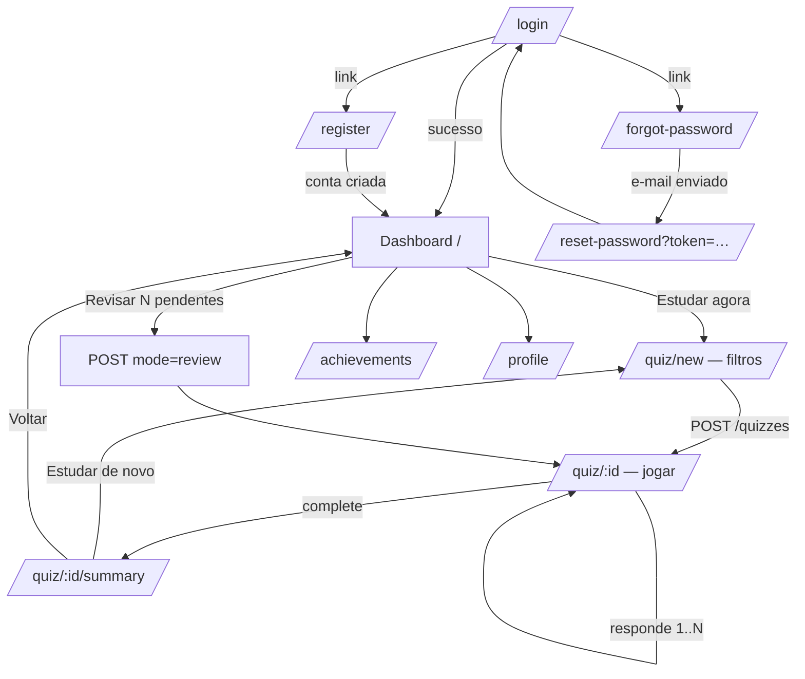

# Mavva — Frontend: Navegação, Componentes e Design

## 1. Fluxo de navegação



Regras de rota:
- `<RequireAuth>` envolve tudo exceto as 4 rotas públicas; sem sessão → redirect `/login`
  (guardando `from` para voltar após login).
- Sessão de quiz abandonada: ao reabrir `/quiz/:id`, continua de onde parou
  (estado vem do servidor, não de localStorage).

## 2. Layout

- **AppShell** (rotas protegidas): sidebar fixa no desktop (logo, nav, card de streak) →
  vira bottom tab bar no mobile (Dashboard · Estudar · Revisar · Conquistas · Perfil).
- **Tela de quiz é fullscreen focado** (sem sidebar): barra de progresso no topo,
  botão de sair com confirmação — como o Duolingo.
- Rotas públicas: layout centralizado com card único.

## 3. Árvore de componentes (principais)

```
app/
├── AppProviders (QueryClientProvider, AuthProvider, Router)
├── AppShell (Sidebar / BottomTabs + <Outlet/>)
└── RequireAuth

components/ui/            ← design system
├── Button (primary/secondary/ghost/danger + loading)
├── Card, Badge, Chip
├── Input, PasswordInput, Select
├── ProgressBar (quiz), ProgressRing (meta diária)
├── Skeleton, Spinner, EmptyState
├── Modal, Toast
└── AnimatedNumber (contador de XP)

features/auth/
├── LoginPage, RegisterPage, ForgotPasswordPage, ResetPasswordPage
└── useAuth (context: user, accessToken em memória, login/logout/refresh)

features/dashboard/
├── DashboardPage
├── StatsRow (XP, nível, streak, acurácia, tempo)
├── DailyGoalRing
├── StreakFlame (animação quando estendido hoje)
├── EvolutionChart (XP/dia, 30 dias — recharts)
├── CategoryPerformanceList
├── RecentSessionsList
└── RecommendationCards

features/quiz/
├── QuizConfigPage (testamento, categoria, dificuldade, nº de perguntas)
├── QuizPlayPage (orquestra a sessão)
│   ├── QuizProgressBar
│   ├── QuestionCard
│   │   ├── MultipleChoiceOptions (4 botões, estados: idle/selected/correct/wrong)
│   │   └── OpenAnswerInput (input + submeter com Enter)
│   ├── AnswerFeedback (banner verde/vermelho + explicação + ReferenceTag + divergência)
│   └── QuizExitModal
└── QuizSummaryPage (acertos, XP animado, streak, level-up, conquistas desbloqueadas)

features/review/   → ReviewPage (resumo SRS + CTA que cria sessão mode=review)
features/achievements/ → AchievementsPage (grid de medalhas, bloqueadas em cinza + progresso)
features/profile/  → ProfilePage (nome, meta diária, timezone, logout)
```

## 4. Estado

| Estado | Onde vive |
|---|---|
| Sessão de auth (user + access token) | `AuthProvider` (memória; refresh via cookie recupera após F5) |
| Dados da API (dashboard, quiz, conquistas…) | React Query (`staleTime` curto; invalidação após mutações de quiz) |
| Estado efêmero de UI (opção selecionada, modal aberto) | `useState` local |

Sem Redux/Zustand no MVP — não há estado global de cliente que justifique.

## 5. Design system

**Personalidade:** paz + crescimento + gamificação moderna. Duolingo na energia,
Notion na clareza. Zero clichê religioso.

| Token | Valor | Uso |
|---|---|---|
| `primary` | verde `#16a34a` (escala 50–900) | ações, acertos, crescimento ("maná/vida") |
| `accent` | âmbar `#f59e0b` | XP, streak, celebração |
| `danger` | vermelho `#ef4444` | erros de resposta |
| `surface` | branco / cinza-100 | cards sobre fundo `#f8fafc` |
| Tipografia | **Nunito** (700/800 títulos, 400/600 corpo) | arredondada e amigável, legível |
| Raio | `rounded-2xl` em cards/botões | suavidade |
| Sombra | soft (`shadow-sm` + borda) | Notion-like, sem skeuomorfismo |

**Microinterações (motion):**
- Resposta correta: option pulsa verde + XP flutua (`+15 XP`)
- Resposta errada: shake sutil + correta revelada em verde
- Barra de progresso do quiz: spring
- Level-up e streak no summary: escala + confete discreto
- Transições de página: fade/slide 150–200 ms

**Acessibilidade:** contraste AA, foco visível, feedback nunca só por cor
(ícones ✓/✗ acompanham), inputs com labels reais.

## 6. Responsividade

Mobile-first. Breakpoints Tailwind padrão. Dashboard: 1 coluna (mobile) → grid 12
(desktop). Quiz: já é uma coluna estreita centralizada em qualquer tela — portabilidade
direta da UX para o futuro app.
